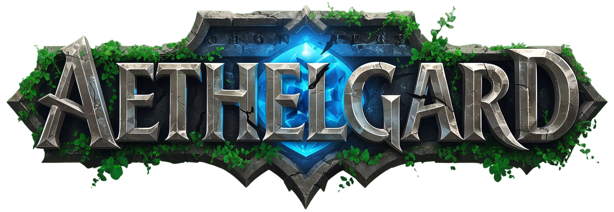

**Chronicles of Aethelgard** is a Massively Multiplayer Online (MMO) strategy game set in a persistent high-fantasy world. Lead your civilization from the ruins of a magical age, build powerful cities, forge mighty armies, and conquer your place in a shattered world.

The game combines elements of Real-Time Strategy (RTS), City-Building Simulation, and 4X Strategy (eXplore, eXpand, eXploit, eXterminate).

## 📜 Lore & Vision

The world of Aethelgard is defined by the contrast between the lost, elegant splendor of the "Age of Harmony" and the harsh, pragmatic struggle for survival in the "Age of Decay." As the leader of a group of survivors, you discover a shard of a God's Tear, which allows you to tame the wild mana and found a new civilization.

The visual style follows the vision of "Lost Splendor & Rough New Beginnings"—a blend of high fantasy and a magical post-apocalypse, with influences from Gothic architecture and Roman antiquity.

## ✨ Core Features (Current Status)

This project is under active development. The following core mechanics are already implemented and playable:

## 🏙️ City Building & Resource Management

**Resource Production:** Build sawmills, quarries, farms, and mana mines to fuel your economy. Resources are generated in real-time.
**Building Upgrades:** Construct and upgrade buildings like the barracks to unlock new units and specialize your city.
**Detailed City View:** Manage each city individually through its own dedicated user interface.

## ⚔️ Military & Combat System

**Unit Training:** Recruit various unit types such as swordsmen, archers, and knights in the barracks.
**Deterministic Combat System:** No luck, just strategy! The outcome of a battle is determined purely by army composition, research, and the counter system (e.g., cavalry > ranged).
**Detailed Battle Reports:** Analyze past battles to optimize your strategy for future engagements.

## 🗺️ Interactive World Map

**Explore & Expand:** Discover a procedurally generated world map divided into tiles and chunks.
**Settle:** Found new cities in strategic locations to expand your empire.
**Missions & Actions:** Send your armies on missions to attack other players, raid NPC camps, or gather resources.

## 🔬 Research System

**Technology Tree**: Unlock new abilities, units, and bonuses through research. Improve military technologies like blacksmithing or civil advancements like administration.

## 🛠️ Tech Stack

_Framework_: Next.js (App Router)
_Language_: TypeScript
_Database & Backend_: Firebase (Firestore for the database, Authentication for users)
_API_: Next.js API Routes & server-side Cloud Functions for time-based processes (e.g., mission processing).
_Frontend_: React, Leaflet for the world map
_Styling_: CSS Modules & global styles

## 🚀 Getting Started

Follow these steps to set up the project locally and start the development server.

1. Install Dependencies
   `npm install`

2. Configure Environment Variables
   Create a `.env.local` file in the root directory and add your Firebase configuration and other necessary variables.

```
# Firebase Client Config
NEXT_PUBLIC_FIREBASE_API_KEY=...
NEXT_PUBLIC_FIREBASE_AUTH_DOMAIN=...
NEXT_PUBLIC_FIREBASE_PROJECT_ID=...
NEXT_PUBLIC_FIREBASE_STORAGE_BUCKET=...
NEXT_PUBLIC_FIREBASE_MESSAGING_SENDER_ID=...
NEXT_PUBLIC_FIREBASE_APP_ID=...

# Firebase Admin Config (for the backend)

FIREBASE_ADMIN_PROJECT_ID=...
FIREBASE_ADMIN_PRIVATE_KEY=...
FIREBASE_ADMIN_CLIENT_EMAIL=...

# NextAuth

NEXTAUTH_URL="http://localhost:3000"
NEXTAUTH_SECRET="YOUR_SECRET_KEY_HERE"
```

3. Start the Development Server
   `npm run dev`

Open http://localhost:3000 in your browser to see the result.
